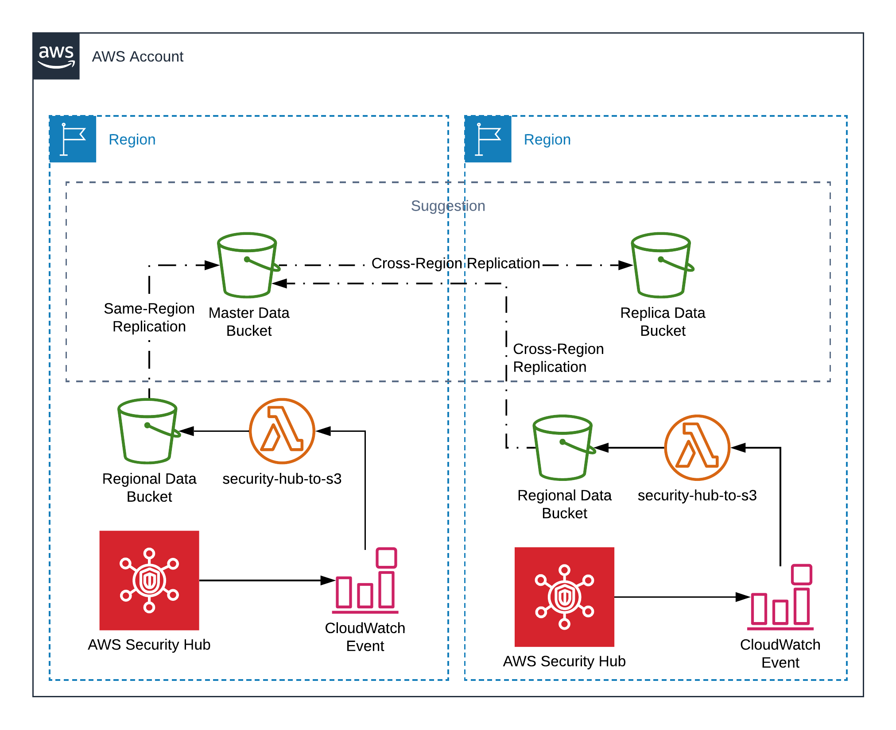

# AWS Security Hub Findings to S3 via CloudWatch Events
Want to store your Security Hub findings for longer than 90 days? Deliver all your findings to S3 in a format that is compatible with Athena!

## Usage
Deploy `security-hub-to-s3.yml` via Cloudformation in the region of your Security Hub. Provide the Bucket Name for where you would like the data stored.

Consider running an additional master bucket for all regions and using Cross-Region Replication to keep redundant copies of the data. A suggested architecture for this is below.

## Architecture
The following includes the architecture of the included Lambda and a suggested architecture for the Buckets.
Files are stored in your designated bucket in the format `SecurityHub/${region}/${year}/${month}/${day}/${event.time}-${event.id}-${index-of-finding-in-event}.json.gz`

